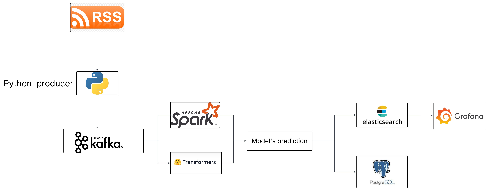
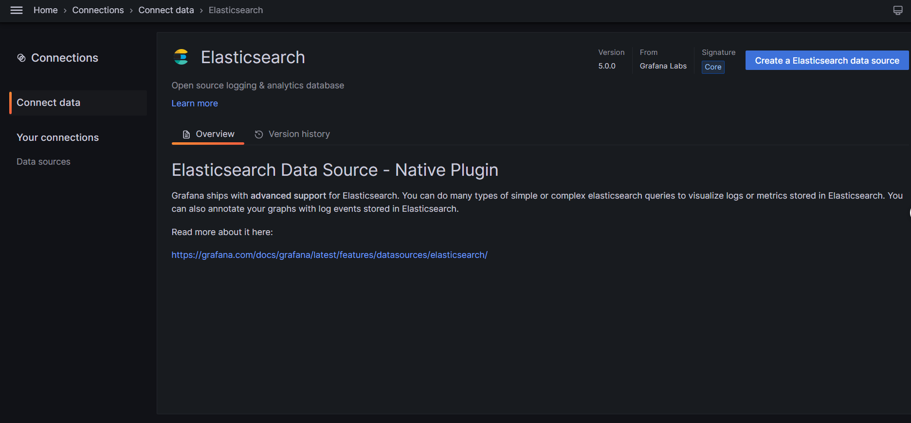
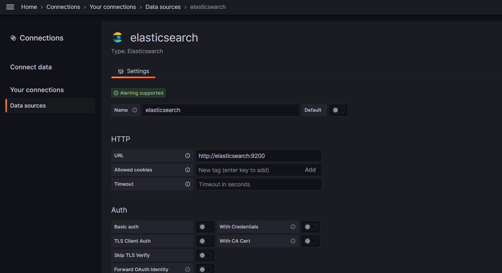
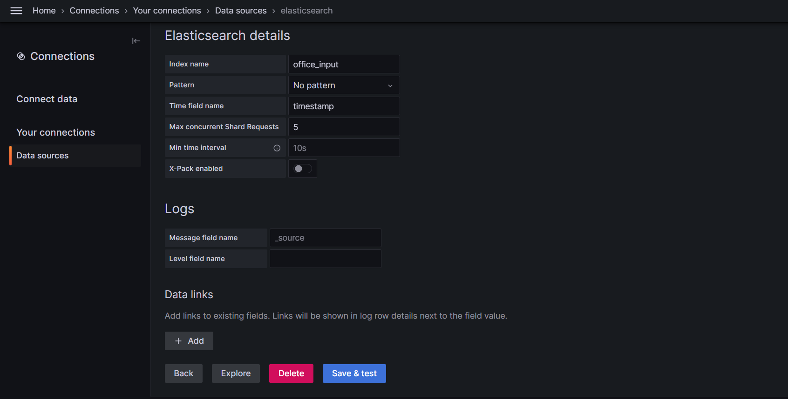
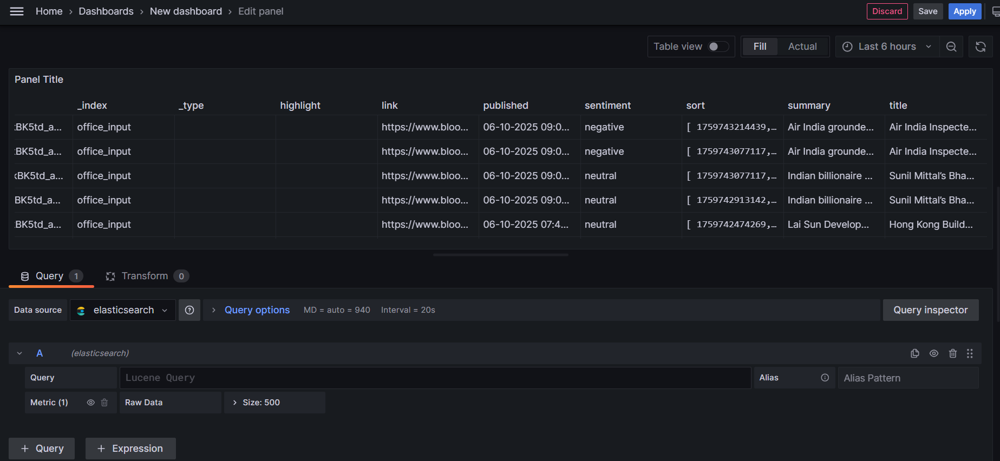

# Realtime_pineline
[](https://opensource.org/licenses/MIT)


## Description 📝
This project demonstrates a real-time news analysis pipeline. It fetches news from a Bloomberg RSS feed, performs sentiment analysis using a pre-trained BERT model, and stores the results in Elasticsearch and PostgreSQL. The pipeline leverages Kafka for message queuing and Spark for stream processing.


## Table of Contents 📚
- [Realtime\_pineline](#realtime_pineline)
  - [Description 📝](#description-)
  - [Table of Contents 📚](#table-of-contents-)
  - [Features ✨](#features-)
  - [Tech Stack 💻](#tech-stack-)
  - [Project Structure](#project-structure)
  - [Installation 🛠️](#installation-️)
  - [Usage 🚀](#usage-)
    - [Real World Use case:](#real-world-use-case)
    - [How to use](#how-to-use)
  - [Project Structure 📂](#project-structure-)
  - [Contributing 🤝](#contributing-)
  - [License 📜](#license-)


## Features ✨
- **Real-time News Feed Processing**: Fetches news articles from the Bloomberg RSS feed.
- **Sentiment Analysis**: Uses a pre-trained BERT model to determine the sentiment of news summaries (positive, negative, or neutral).
- **Message Queuing with Kafka**: Employs Kafka to handle the stream of news articles.
- **Stream Processing with Spark**: Utilizes Spark Streaming to process and analyze news data in real-time.
- **Data Storage**: Stores processed data in both Elasticsearch for search and analytics, and PostgreSQL for structured storage.
- **Containerized Deployment**: Uses Docker and Docker Compose for easy setup and deployment.
- **Monitoring with Grafana**: Includes configuration for Grafana to visualize the data.


## Tech Stack 💻
- **Programming Language**: Python
- **Frameworks**: PySpark, Transformers, Elasticsearch, Kafka
- **Containerization**: Docker, Docker Compose
- **Data Storage**: Elasticsearch, PostgreSQL
- **Configuration**: YAML, JSON
- **Visualization**: Grafana

## Project Structure

## Installation 🛠️
1. **Clone the repository:**
   ```bash
   git clone https://github.com/Cngdz/Realtime_pineline.git
   cd Realtime_pineline
   ```

2. **Install Docker and Docker Compose:**
   Make sure you have Docker and Docker Compose installed on your system. You can find installation instructions on the official Docker website.

3. **Building the necessary Images:**
   The Dockerfiles for `news-producer` and `spark-app` are located in their respective directories. The `docker-compose.yml` file uses these to build the images.

   ```bash
   docker-compose build
   ```

4. **Start the services using Docker Compose:**
   ```bash
   docker-compose up -d
   ```
   This command builds and starts all the necessary services (Zookeeper, Kafka, Elasticsearch, News Producer, Spark Master, Spark Worker, Grafana, and Postgres).


## Usage 🚀
1. **Access Grafana**: Open your web browser and go to `http://localhost:3000` to access the Grafana dashboard.  The `docker-compose.yml` file sets up Grafana with a provisioning directory. Dashboards can be created to monitor and visualize data.

2. **Interact with Elasticsearch**: Elasticsearch can be accessed at `http://localhost:9200`. You can use Grafana to connect to Elasticsearch. 
 - **Connection -> Elasticsearch -> Create a Elasticsearch data source**
 - Fill the necessary informaion : 
   - **Name** : `elasticsearch`
   - **URL** : `http://elasticsearch:9200`
   - **Index name** : `office_input`
   - **Time field name** : `timestamp`
 - **Save and Test**
  
  
  
 - After that, you can use Grafana to visualize the data from Elasticsearch
  

3. **Connect to PostgreSQL**: Connect to the PostgreSQL database using a client of your choice with the following credentials:
   - Host: `localhost`
   - Port: `5432`
   - Database: `newsdb`
   - User: `spark`
   - Password: `spark123`


### Real World Use case:
Imagine a financial firm needing to monitor real-time news sentiment to make quick trading decisions. This project can be used as follows:

1.  **Collect News**: The `news-producer` service continuously fetches news from Bloomberg's RSS feed.
2.  **Analyze Sentiment**: The `spark-app` service analyzes the sentiment of each news article using a pre-trained BERT model.
3.  **Store Data**: The analyzed data, including the sentiment score, is stored in Elasticsearch and PostgreSQL.
4.  **Visualize Insights**: Grafana is used to create dashboards that display real-time sentiment trends, allowing traders to quickly identify and react to market-moving news.


### How to use
1.  **Start the Pipeline**: Run `docker-compose up -d` to start all services.
2.  **Monitor Data Flow**: Check the logs of the `news-producer` and `spark-app` containers to ensure data is flowing correctly.
3.  **Access Grafana Dashboard**: Open Grafana at `http://localhost:3000` to monitor the data.


## Project Structure 📂
```
Realtime_pineline/
├── docker-compose.yml        # Docker Compose configuration file
├── producer/
│   ├── Dockerfile            # Dockerfile for the news producer
│   ├── news_producer.py      # Python script to fetch and send news to Kafka
│   ├── requirements.txt      # Python dependencies for the producer
│   └── sent_news.json        # Cache of sent news links
├── spark-app/
│   ├── Dockerfile            # Dockerfile for the Spark application
│   ├── requirements.txt      # Python dependencies for the Spark application
│   ├── streaming_job.py      # Spark streaming job for sentiment analysis
│   ├── models/               # Pre-trained sentiment analysis model
│   │   ├── config.json
│   │   ├── special_tokens_map.json
│   │   ├── tokenizer.json
│   │   ├── tokenizer_config.json
│   │   ├── training_args.bin
│   │   ├── model.safetensors
|   |   └── vocab.txt
├── config/
└── README.md               # Project README file
```


## Contributing 🤝
Contributions are welcome! Please follow these steps:

1.  Fork the repository.
2.  Create a new branch for your feature or bug fix.
3.  Make your changes and commit them with descriptive commit messages.
4.  Submit a pull request.

